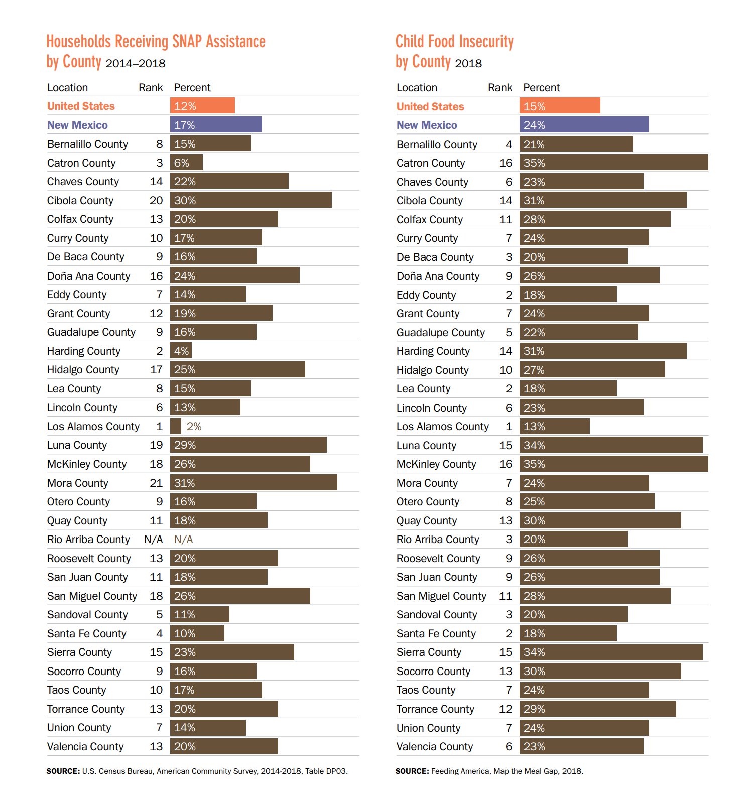
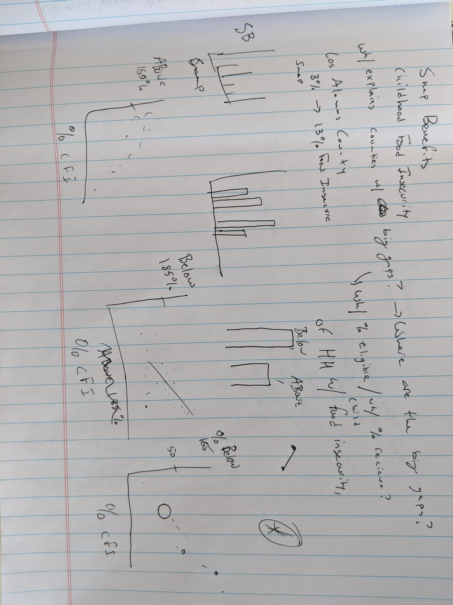

# Assignment 3 & 4 - Data Critique

## The Original Visualization

For this assignment, I chose a data visualization from the policy advocacy non-profit [New Mexico Voices for Children](https://www.nmvoices.org/). I chose this visualization first because NM Voices does a lot of policy work in New Mexico, my home state. The visual comes from the [2020 KIDS COUNT databook](https://www.nmvoices.org/wp-content/uploads/2021/02/KidsCount-DataBook2020-web.pdf), published annually. It's intended for state lawmakers and policy practitioners, especially those working in education policy. The visualization below caught my attention because it presented an interesting relationship between two variables. I thought it could be improved because it wasn't easy to draw conclusions on first glance, but I thought it had important implications.

Image taken from "2020 New Mexico KIDS COUNT Data Book: Building on Resilience" 2020. Accessed 2/21/2021. https://www.nmvoices.org/wp-content/uploads/2021/02/KidsCount-DataBook2020-web.pdf

### My Critique

Aesthetic: The main tone is brown with some orange and purple. On top of the flat color, there are a lot of numbers close to one another, which makes it overwhelming to look at.

Content: The visual works because it asks an interesting question: what is the relationship between the percentage of households receiving SNAP assistance and the percentage of child food insecurity? This works well because it's unique and the relationship is not at once obvious. A curious reader wants to dig in. The intended audience is policymakers and those with policy backgrounds, and the designer understood this format would work for audience. The visual contains specific information and sparks a question. A general relationship between the two variables can be drawn, and that relationship can, at a high-level, inform policy recommendations. 

Issues: The visual lacks clarity and some level of context. First, the visualization is not visually appealing. An average person might not bother to look for the relationship in their county because there's a lot of noise. In fact, the only audience who would want to dig deeper are policymakers, and policymakers might prefer a differ visual. For example, a table can convey the needed information in a smaller space. In addition to the aesthetic, the visual lacks some context. The first statistic gives the percentage of households receiving SNAP assistance, and the second gives the percentage of child food insecurity. Because the first is analyzed at the household level and the second is analyzed at the individual child level, it's unclear how they compare. Is a one-to-one comparison appropriate? Is there an intermediate statistic that better captures the relationship? Without the full context, the reader is left with questions.  

## The Redesign Process

### Step 1: Preliminary Sketching

The first step in my redesign process was to find the original data. I was able to download the original data from from [Map the Meal Gap](https://www.feedingamerica.org/research/map-the-meal-gap/how-we-got-the-map-data). I started to read about the data and quickly saw information that may not have made it to the final publication visual. After this step, I started making a list of ways I could represent the relationship between the percent of households receiving SNAP and child food insecurity. I quickly sketched a scatterplot and thought I was on to something. I wrangled my data into Excel and started exploring. Before I knew it, I had 4 - 5 scatterplots, each comparing different variables. 

Unfortunately, this was a mistake. The relationships were complex and unclear. Simple scatterplots were not going to do the data justice, and I realized just how far I was outside the realm of my expertise. Scatterplots between variables I did not understand just deepened the confusion. Further, I realized that the more complicated I made my redesign, the more likely it was that I misrepresent the information. I took a step back from the software and returned to the suggested work flow in the textbook. 

Here's a view of the rushed sketches that made me jump right away into Excel. Fortunately, these were cleaned-up in later stages of the process.

### Step 2: Discussing

After the Excel distraction, I consulted with my roommate. Like suggested in the textbook, I started talking generally about what I was working on. My roommate's questions started getting the gears turning in the right direction. I showed her some of my sketches, and she suggested I stay away from a scatterplot. She (rightly) identified there was no clear relationship between the two. Even if there were, the sample was too small to draw any conclusions (n = 30). 

We talked for about 20 minutes and I made about 1/4 page of notes. Toward the end of our conversation, she made a very good point: the reader was most likely to care about their county. A bar chart would be best because it conveyed clear information about a single geographic point. That information could be contrasted to the rest of the information, but the info would be important because it represented something personal. I agreed. This reminded me of Evan Peck's "Data is Personal. What We Learned from 42 Interviews in Rural America."

Further, I identified in the critique phase that the report's intended audience was policymakers. Policymakers were most likely to care about what the situation looked like for their constituents. If there were actionable policy outcomes tied to the data, they would be best supported if the problem was visualized in their county.

### Step 3: Redesigning

I opened my data into flourish studio and began experimenting. Because I had already decided on a bar chart format, this portion of the assignment actually took the least amount of critical thinking. I played around with a few ways to combine the three variables, but I found these distracting. I soon settled on three bar charts, one for each variable. Once at this point, the visualization was mostly a matter of adding specific elements to help tell the story better. There were three instances of this:

  1) Adding color. I added color to the counties with the highest rates of child food insecurity. My idea was for the reader to track the counties with the highest rate of child food insecurity throughout the three visuals. This would not express the full extent of the relationship, but it might start to draw connections between the two.
  2) Averages. I added the state and national average as a dashed line in two of the visuals. I was struck with how much higher the New Mexico average was than the U.S. average. There was also a large difference across the state, with some doing well and others poorly.
  3) Headers. I spent a considerable amount of time crafting headers. I wanted the reader to take away a conclusion from the header, not just context. I had 3 - 4 iterations for each of the 3 charts.

### Final Redesign

Given more time (and expertise in Flourish), I would add a feature where I user could select counties to track across the three variables. This would help tell a more immersive story.

