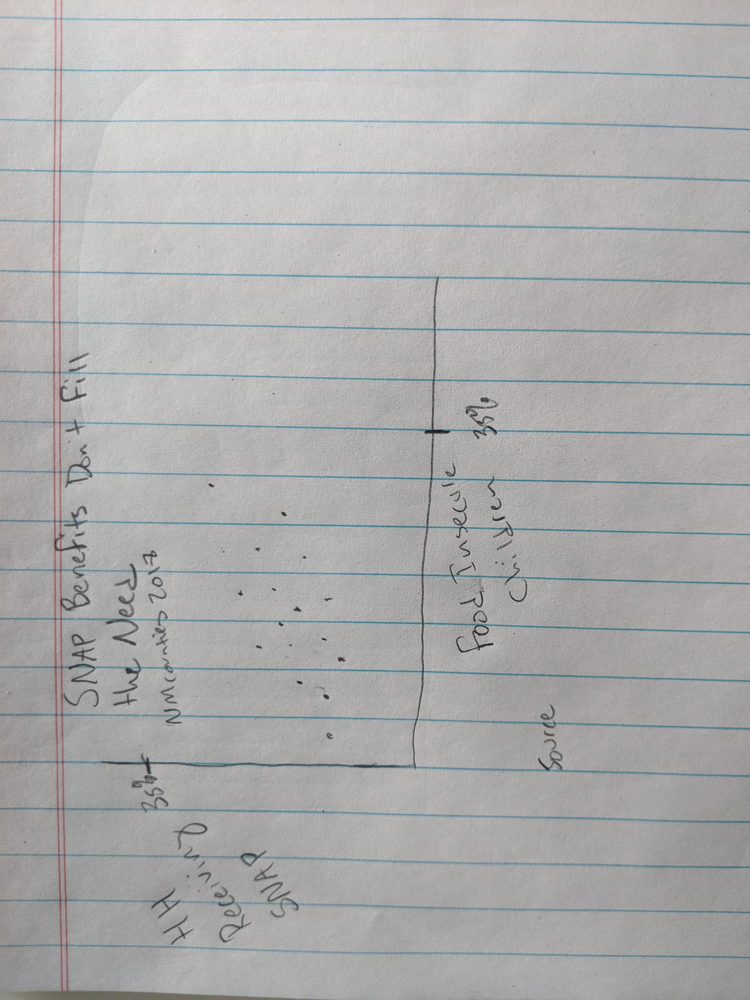
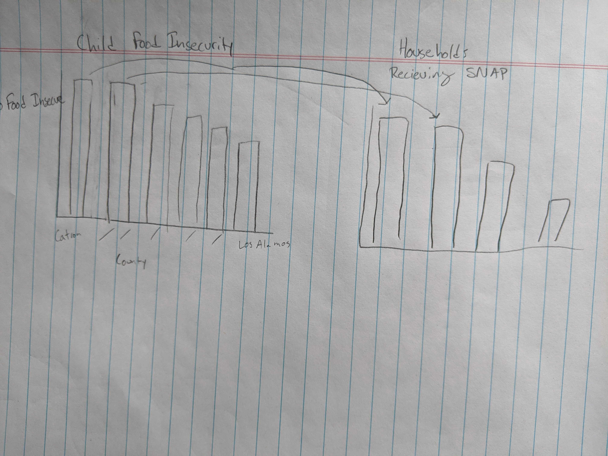

# Assignment 3 & 4 - Data Critique

## The Original Visualization

For this assignment, I chose a data visualization from the [2020 KIDS COUNT databook](https://www.nmvoices.org/wp-content/uploads/2021/02/KidsCount-DataBook2020-web.pdf), published annually by New Mexico Voices for Children. It's intended for state lawmakers and policy practitioners, especially those working in education policy. The visualization below caught my attention because it presented an interesting relationship between two variables: the percent of households that receive SNAP assistance and the percentage of food insecure children. I thought it could be improved because it wasn't easy to draw conclusions on first glance, but I thought it had important implications.

Image taken from "2020 New Mexico KIDS COUNT Data Book: Building on Resilience" 2020. Accessed 2/21/2021. https://www.nmvoices.org/wp-content/uploads/2021/02/KidsCount-DataBook2020-web.pdf

I identified a few issues with the aesthetic of the visual, but my main concerns were with the clarity and context. It's not clear if there is a relationship between households recieving SNAP and food insecure children. The visual indicates there may be. 

## The Redesign Process

### Step 1: Preliminary Sketching

The first step in my redesign process was to find the original data. I was able to download the original data from from [Map the Meal Gap](https://www.feedingamerica.org/research/map-the-meal-gap/how-we-got-the-map-data). I was quickly seeing how additional context could improve the visualization. For example, the original data source had information on the percent of food insecure children living in homes _eligible_ for SNAP. I experimented with the design in wireframes. My initial thought was to put the data into a scatterplot. I wasn't confident a scatterplot was appropriate, especially because the original authors presented the variables seperately. I decided to include both wireframes when presenting my ideas to others.

### Step 2: Discussing

When I asked two people to give me feedback, I began by talking generally about what I was working on. With both people, their questions started getting the gears turning in the right direction. Once I had described the data and shown my sketches, both immediately suggested I stay away from a scatterplot. A scatterplot implied that there is a relationship between the two variables. This may be misleading. And regardless of the relationship, the sample was too small to draw any conclusions (n = 30). 

I talked for about 20 minutes and I took about a page of notes. Toward the end of one conversation, a very good point was made: the reader was most likely to care about their county. A bar chart would be best because it conveyed clear information about a single geographic point. That information could be contrasted to the rest of the information, but the info would be important because it represented something personal. I agreed. This reminded me of Evan Peck's "Data is Personal. What We Learned from 42 Interviews in Rural America."

I decided to improve upon the second wireframe. I wanted to focus on ways to use color, format, and engaging headers to provide useful context.

### Step 3: Redesigning

I opened my data into flourish studio and began experimenting. Because I had already decided on a bar chart format, this portion of the assignment actually took the least amount of critical thinking. I played around with a few ways to combine the three variables, but I found these distracting. I soon settled on three bar charts, one for each variable. Once at this point, the visualization was mostly a matter of adding specific elements to help tell the story better. There were three instances of this:

  1. **Adding color.** I added color to the counties with the highest rates of child food insecurity. My idea was for the reader to track the counties with the highest rate of child food insecurity throughout the three visuals. This would not express the full extent of the relationship, but it might start to draw connections between the two.
  2. **Averages.** I added the state and national average as a dashed line in two of the visuals. I was struck with how much higher the New Mexico average was than the U.S. average. There was also a large difference across the state, with some doing well and others poorly.
  3. **Headers.** I spent a considerable amount of time crafting headers. I wanted the reader to take away a conclusion from the header, not just context. I had 3 - 4 iterations for each of the 3 charts.

### Final Redesign

I like the new visual even though there are significant changes. They're more interesting to look at, and they communicate more context for the reader. Given more time (and expertise in Flourish), I would add a feature where I user could select counties to track across the three variables. This would help tell a more immersive story that was useful for the reader.

