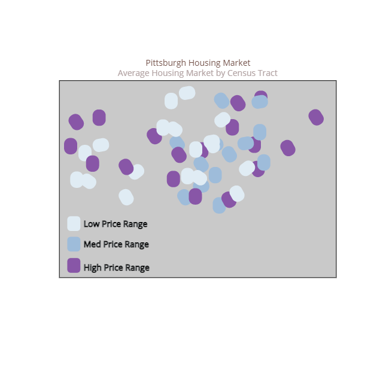

# Final Project Outline

## High Level Summary
For my project, I want to highlight some of the consequences federal redlining policies have on the current Pittsburgh housing market. I am particularly interested in demonstrating the differences across the redlined "border," where adjacent neighborhoods had different access to lending and where those effects are born in the market today. 

## Story Summary

* **Setup:** The housing market in Pittsburgh has clusters of high-value homes and clusters of low-value homes.
* **Conflict:** 
  * **Point one:** In Pittsburgh, the federal government used lending policies in the 1930s and 1940s to systematic deny access to homeownership to non-white communities and especially Black communities. 
  * **Point two:** The consequences are still borne in the market today. More importantly, the effects on people today.
* **Resolution:** There are ways for you to find out ways you have benefitted from these policies in Pittsburgh. There are also local, state, and federal policies that can start to work against this denial of homeownership.

# Initial Sketches

**Header 1:** The Pittsburgh housing market.

**Header 2:** History of Housing Policy

**Header 3:** HOLC Maps and their consequences.

Breakdown of differences across redlined grades.

# The Data

The data for my project comes from two sources. First, redlining maps from the Home Owners' Loan Corporation (HOLC) are available from the [Mapping Inequality Project of the Digital Scholarship Lab at the University of Richmond](https://dsl.richmond.edu/panorama/redlining/#loc=5/39.1/-94.58). These maps have been geocoded and are downloadable directly from the website. Housing market data is publically available from the [Western Pennsylvania Regional Data Center (WPRDC)](https://data.wprdc.org/dataset/real-estate-sales) and contains all property transactions since 2013. The redlining maps and the property sales data can be spatially joined for analysis. I also plan to download data from the 2010 decennial census and the 2019 American Community Survey for high-level demographic information, such as resident race and ethnicity and population change. These will help contextualize the story narrative, but will not be a focus. These will both be accessed through the Census's publically available data [website] (https://data.census.gov/cedsci/). Lastly, I will use the [Zillow Home Value Index (ZHVI)] (https://www.zillow.com/research/data/) for the most accurate and reliable housing price averages across large geographies. This will help round out the property sale data, which is very good at revealing information at a granular level, but contains inaccuracies when comparing averages across large geographies. For example, properties that do not sell are not recirded in the WPRDC data, biasing the results.

Once fully cleaned, I plan to use Tableau to build maps with various levels of granularity. For example, while I plan to display the property sales as individual geographic points, my primary visualizations will involve aggregating data to neighborhoods, Census tracts, or Census block groups. I have (limited) experience with this type of aggregation and manipulation using GIS packages in R.

# Methods

I plan on using Shorthand to publically present my story. Most of my data visualizations will be built in Tableau. I imagine creating basic tables for some visualizations in Canva. I have chosen Shorthand as my medium instead of a mapping-making platform like ArcGIS Story Maps because I want the focus to be on the story, not the map. Because I do not have the capability nor experience to build out fully integrated map data, I would like the reader to draw conclusions primarily from the non-map features of the story, such as well-designed timelines and tables. The maps, while helpful, will be a highlight to these primary storytelling devices.  

